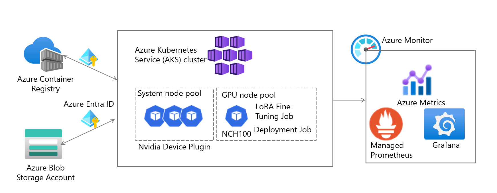
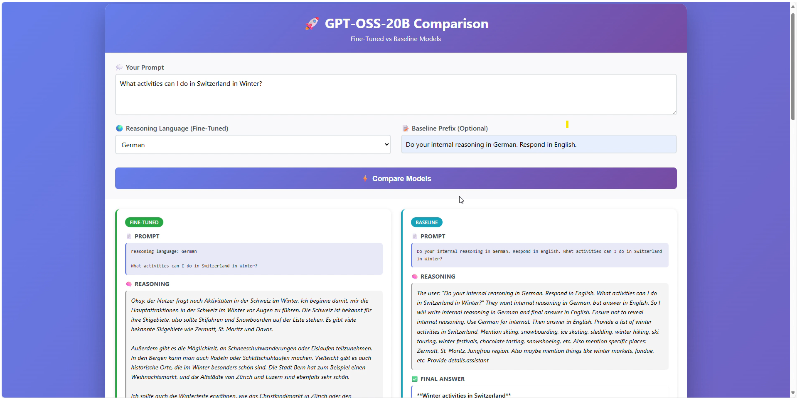

# AKS GPU Fine-tuning with LoRA

Fine-tune and deploy large language models on Azure Kubernetes Service (AKS) with GPU support using LoRA (Low-Rank Adaptation).

## Use Case

**Problem:** Organizations need AI models that perform internal reasoning in a specific language (e.g., for regulatory audits) while maintaining flexibility in input/output languages for end users.

**Solution:** LoRA fine-tuning to modify the model's reasoning behavior—something not achievable through RAG, prompt engineering, or agentic approaches.

**Example:** A Swiss bank requires all AI reasoning traces to be in German for audit compliance, but wants customers to interact in any language. The fine-tuned model:
- Receives a question in English, French, or any language
- Performs all internal chain-of-thought reasoning in German
- Responds to the user in their original language

This repo demonstrates fine-tuning GPT-OSS 20B to achieve this behavior using LoRA on Azure Kubernetes Service with H100 GPUs.

## Architecture



## Demo




## Features

- **Automated Azure Infrastructure**: Creates AKS cluster, ACR, storage, and managed identities
- **GPU-Optimized**: Uses NVIDIA GPU Operator and NC-series VMs
- **GPU Monitoring**: Azure Managed Prometheus + Grafana with DCGM metrics
- **LoRA Fine-tuning**: Efficient fine-tuning with parameter-efficient methods
- **Side-by-Side Inference**: Compare fine-tuned vs baseline models via Web UI

## Prerequisites

**Tools:**
- **Azure CLI** - [Install](https://docs.microsoft.com/en-us/cli/azure/install-azure-cli)
- **kubectl** - [Install](https://kubernetes.io/docs/tasks/tools/) or `az aks install-cli`
- **Helm** - [Install](https://helm.sh/docs/intro/install/)
- **Bash shell** - WSL/WSL2 (Windows), Terminal (macOS/Linux), or Git Bash

**Azure:**
- Azure subscription with **Owner** or **Contributor + User Access Administrator** role
- GPU quota for `Standard_NC80adis_H100_v5` (80 vCPUs or 1 node) in your region
- Request quota at: [Azure Portal → Quotas](https://portal.azure.com/#view/Microsoft_Azure_Capacity/QuotaMenuBlade/~/myQuotas)
## Quick Deploy

```bash
# 1. Configure your environment
cp config.sh.template config.sh
# Edit config.sh with your Azure subscription and settings
# Requires Azure subscription with GPU quota for NC80adis_H100_v5 adjust region if needed

# 2. Login to Azure
az login

# 3. Run deployment
bash ./scripts/quick-deploy.sh
```

This will:
1. Create Azure resources (resource group, storage, ACR, managed identity)
2. Create AKS cluster with GPU node pool
3. Setup GPU monitoring (Prometheus + Grafana)
4. Build and push Docker images
5. Deploy fine-tuning job (~20 mins)
6. Deploy inference service with Web UI

## Monitor Fine-tuning

```bash
kubectl get jobs -n workloads
kubectl logs job/gpt-oss-finetune -n workloads -f
```

## GPU Monitoring

The monitoring script automatically sets up:
- Azure Monitor Workspace (Managed Prometheus)
- Azure Managed Grafana with DCGM dashboard
- NVIDIA DCGM metrics scraping

Access Grafana URL from the script output or Azure Portal.

**Test queries in Grafana Explore:**
- `DCGM_FI_DEV_GPU_UTIL` - GPU utilization
- `DCGM_FI_DEV_GPU_TEMP` - GPU temperature
- `DCGM_FI_DEV_FB_USED` - GPU memory usage

Alternatively, visit the DCGM Dashboard for GPU metrics visualization.

## Access Inference Service

```bash
kubectl get svc gpt-oss-inference -n workloads
# Use the EXTERNAL-IP to access the Web UI
```

## Individual Steps

```bash
./scripts/01-setup-azure-resources.sh   # Azure resources
./scripts/02-create-aks-cluster.sh      # AKS cluster (GPU pool at 0 nodes)
./scripts/03-setup-gpu-monitoring.sh    # Prometheus + Grafana
./scripts/04-build-and-push-image.sh    # Docker build
./scripts/05-deploy-finetune.sh         # Scales up GPU, deploys job
./scripts/06-deploy-inference.sh        # Inference service
```

## Cost Optimization

**GPU nodes start at 0** - The GPU nodepool is created with 0 nodes to avoid idle costs (~$20/hr). 
Script 05/06 automatically scales up when deploying workloads.

```bash
# Manual scale down after training
az aks nodepool update \
    --resource-group <rg-name> --cluster-name <cluster-name> \
    --name gpupool --min-count 0 --max-count 0
```

## kubectl Context

When creating a new cluster, a new context is added to your kubeconfig:
```bash
kubectl config get-contexts        # List all contexts
kubectl config use-context <name>  # Switch to a different cluster
```

## Notes

- Fine-tuning typically takes ~20 minutes on H100
- GPU nodes take 5-10 minutes to provision when scaling up
- GPU metrics take 3-5 minutes to appear in Grafana after setup
- Uses NVIDIA PyTorch NGC container for optimized performance
- Requires Azure subscription with GPU quota for NC80adis_H100_v5