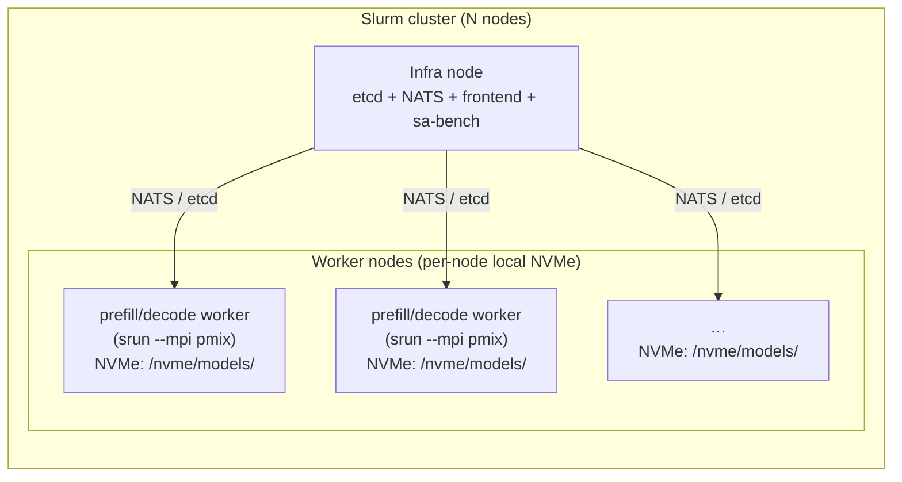
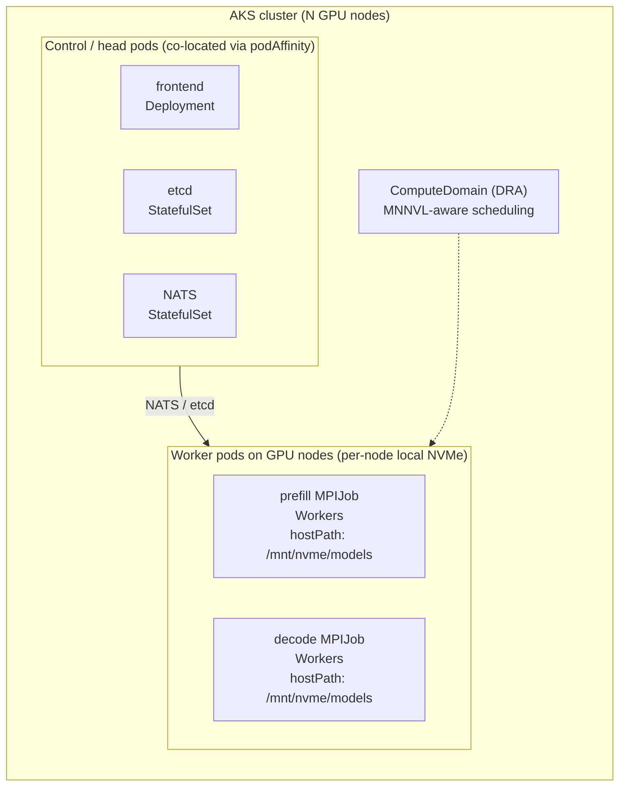
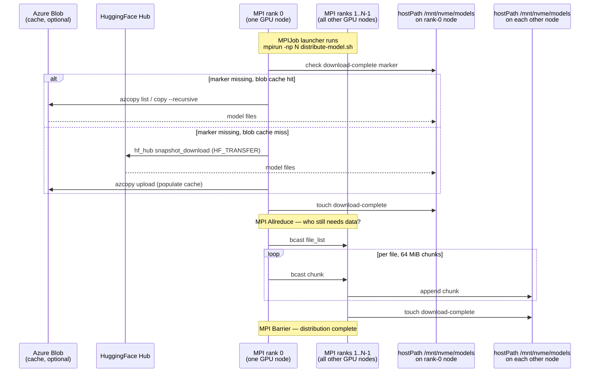

# InferenceX on AKS

Deploy the [InferenceX](https://github.com/SemiAnalysisAI/InferenceX) disaggregated inference benchmark on Azure Kubernetes Service. The chart itself is SKU-agnostic — it targets any NVIDIA GPU node pool that can run the aarch64 TRT-LLM Dynamo runtime image — but the tuned recipes and published results in this repo are **calibrated and validated for GB300 NVL72** (`Standard_ND128isr_GB300_v6`). See [§8 Extending to other SKUs](#8-extending-to-other-skus) for porting notes.

The chart is a port of the official InferenceX / `srt-slurm` reference (DeepSeek R1 0528, FP4, ISL=8192/OSL=1024, MTP spec decoding) from Slurm to Kubernetes. Results are scored against the published InferenceX dashboard (`date=2026-02-03`); all 8 reproduced data points land within ±5% of reference — see [§9 Results](#9-results) and [gb300-benchmark-walkthrough.md](gb300-benchmark-walkthrough.md).

> **Precision note**: "FP4" refers to the **weight precision** (NVFP4-quantized DeepSeek-R1, native Blackwell tensor-core path). The **KV cache is FP8 e4m3** (`kv_cache_config.dtype: fp8` in every `helm/inferencex/values-*.yaml`) — this matches NVIDIA's published GB300 InferenceX reference recipe and is what makes the comparison apples-to-apples. FP8 KV cache preserves long-context accuracy (especially important for DeepSeek-R1's MLA-compressed latents) at half the memory of BF16.

---

## Contents

1. [Port overview: Slurm → AKS](#1-port-overview-slurm--aks)
2. [Architecture](#2-architecture)
3. [Model distribution flow](#3-model-distribution-flow)
4. [Prerequisites](#4-prerequisites)
5. [NVMe storage notes](#5-nvme-storage-notes)
6. [Deploy](#6-deploy)
7. [Running benchmarks](#7-running-benchmarks)
8. [Extending to other SKUs](#8-extending-to-other-skus)
9. [Results](#9-results)
10. [Key porting decisions](#10-key-porting-decisions)
11. [Helm chart layout](#11-helm-chart-layout)
12. [ModelExpress — evaluated, deferred](#12-modelexpress--evaluated-deferred)
13. [Cleanup](#13-cleanup)

---

## 1. Port overview: Slurm → AKS

InferenceX is published with a [`srt-slurm`](https://github.com/ishandhanani/srt-slurm) reference implementation: srtctl recipes → `sbatch` jobs → Enroot containers → `srun --mpi pmix` for distributed launch → `sa-bench` client. This repo re-implements the same inference pipeline as a Helm chart with MPIJobs and sa-bench as a pod-resident client, so the exact same reference numbers can be reproduced on AKS.

Mapping from Slurm primitives to Kubernetes resources:

| Slurm primitive                             | K8s resource in this chart                                                                         |
| ------------------------------------------- | -------------------------------------------------------------------------------------------------- |
| `sbatch` + `srun`                           | MPIJob (prefill + decode) via [kubeflow/mpi-operator](https://github.com/kubeflow/mpi-operator)    |
| Enroot container                            | OCI container (same image: `nvcr.io/nvidia/ai-dynamo/tensorrtllm-runtime:0.8.1.post2`)             |
| Slurm GRES                                  | `nvidia.com/gpu` device plugin + DRA `ComputeDomain` for MNNVL-aware placement                     |
| `--mpi pmix`                                | `mpirun` launched by MPIJob Launcher pod; workers discovered via OpenMPI hostfile                  |
| Slurm nodelist + topology                   | `nodeSelector: agentpool=gb300` + `topologyKey: nvidia.com/gpu.clique`                             |
| Head-node etcd + NATS                       | `StatefulSet` each, `podAffinity` co-located with the frontend                                     |
| HTTP frontend / nginx LB                    | `Deployment` (Dynamo router) + ClusterIP `Service`                                                 |
| Model staged on `/nvme/models/` by `dbcast` | Model downloaded by rank-0 pod, broadcast via MPI to hostPath `/mnt/nvme/models` on every GPU node |
| `sa-bench` on head node                     | `kubectl cp` sa-bench into the frontend pod, run against `http://localhost:8000`                   |
| srtctl YAML recipes                         | Helm values files (`values-gb300-*.yaml`)                                                          |

The important non-difference: **each GPU node has its own local NVMe in both setups.** Slurm `dbcast` and the MPI `model-distribute-mpijob` in this chart solve the same problem — getting one copy of the model onto every node's local disk — just via different mechanisms. Neither uses a shared filesystem.

---

## 2. Architecture

### Slurm (reference)



### AKS (this chart)



Each MPIJob (one for prefill, one per decode group) has a single Launcher pod that runs `mpirun` against Worker pods; Worker pods are the ones that hold GPUs. DRA `ComputeDomain` ensures all GPUs in a given MPI world come from the same MNNVL clique. `hostIPC: true` + `privileged: true` on workers are required for cross-node NVLink.

---

## 3. Model distribution flow

The model (387 GB for FP4, 1.2 TB for FP8) must live on every GPU node's local NVMe before workers start. This chart does that with one download + one MPI broadcast, in a single MPIJob (`model-distribute-mpijob.yaml` → `distribute-model.sh` in `configmap-scripts.yaml`):



Workers mount the same hostPath read-only once the distribute job completes; subsequent recipe swaps reuse the cached model with no re-download. The blob cache is optional (`modelDistribution.blobCache.enabled=false` skips it and always uses HuggingFace) but makes cold starts ~10× faster for large clusters.

---

## 4. Prerequisites

### Cluster

- AKS ≥ 1.33 with a GPU node pool. This repo is validated on `Standard_ND128isr_GB300_v6` (aarch64, 4× GB300 GPUs + 4× ConnectX-7 RDMA NICs per node).
- GPU Operator installed (GPUs visible as `nvidia.com/gpu`). For GB300 specifics — including the `values-no-mofed.yaml` workaround for MOFED build failures against kernel 6.14 — see [`../../../gb300-deploy-aks.md`](../../../gb300-deploy-aks.md).
- Network Operator with an RDMA device plugin (`rdma/ib` resource). On GB300 use the `sriov-device-plugin-no-mofed` NicClusterPolicy.
- MPI Operator ≥ 0.6.0 (`mpijobs.kubeflow.org` CRD).
- cert-manager (MPI Operator dependency).
- NVIDIA DRA driver (for the `ComputeDomain` CRD). The chart falls back gracefully with `--set dra.enabled=false` but MNNVL-aware scheduling won't be used.

### Tools

- `helm` ≥ 3.12
- `kubectl` with context pointing at the AKS cluster
- Azure CLI with the subscription that owns the cluster (only needed if using the blob cache — optional)

### Model access

The chart fetches the model from HuggingFace. For gated models provide a secret:

```bash
kubectl create secret generic hf-token --from-literal=token=hf_YOUR_TOKEN
```

---

## 5. NVMe storage notes

`Standard_ND128isr_GB300_v6` ships 4× ~3.5 TB local NVMe disks as raw block devices on the Azure Ubuntu 24.04 (`Ubuntu2404` OS SKU) VHD. **AKS does not auto-assemble or mount them.** The chart's `nvme-init` DaemonSet (`templates/nvme-init-daemonset.yaml`) is what creates `/mnt/nvme` on every gb300 node:

1. If `/mnt/nvme` is already mounted → no-op.
2. Otherwise: `mdadm --create /dev/md0 --level=0 --chunk=512` across the 4 NVMe disks → `mkfs.ext4` with stride/stripe-width tuned for the raid geometry → `mount -o defaults,noatime,discard /dev/md0 /mnt/nvme`.

The result is a single ~14 TB ext4 volume that the rest of the chart consumes via `hostPath`. The DaemonSet runs forever (`sleep infinity`) so any replaced or rebooted node is re-initialised within seconds of joining — the bind is purely runtime (no `/etc/fstab` entry) and does not survive reboot on its own. Tunables live under `nvmeInit:` in `values-gb300-base.yaml`.

We deliberately do **not** create a StoragePool / CSI StorageClass on top of `/mnt/nvme` — see [§10.4](#104-hostpath-vs-azure-container-storage).

### Inspecting NVMe on a node

```bash
NODE=$(kubectl get nodes -l agentpool=gb300 -o jsonpath='{.items[0].metadata.name}')
kubectl debug node/$NODE -it --image=busybox -- sh -c 'chroot /host bash -c "df -h /mnt/nvme && ls /mnt/nvme/"'
```

### Clearing the hostPath (force full re-distribute)

```bash
# One-shot DaemonSet that wipes /mnt/nvme/models on every gb300 node, then exits.
kubectl apply -f - <<'EOF'
apiVersion: apps/v1
kind: DaemonSet
metadata: { name: clear-models, namespace: default }
spec:
  selector: { matchLabels: { app: clear-models } }
  template:
    metadata: { labels: { app: clear-models } }
    spec:
      nodeSelector: { agentpool: gb300 }
      tolerations:
      - { key: nvidia.com/gpu, operator: Exists, effect: NoSchedule }
      - { key: sku, operator: Equal, value: gpu, effect: NoSchedule }
      hostPID: true
      containers:
      - name: wipe
        image: busybox
        command: ["sh","-c","rm -rf /host/mnt/nvme/models/* && echo done on $(hostname) && sleep 3600"]
        securityContext: { privileged: true }
        volumeMounts: [{ name: host, mountPath: /host }]
      volumes: [{ name: host, hostPath: { path: / } }]
EOF

kubectl rollout status ds/clear-models --timeout=2m
kubectl logs -l app=clear-models --prefix --tail=1
kubectl delete ds clear-models
```

---

## 6. Deploy

The chart has **no default values file**. Values are layered in two files per deploy:

1. **`values-gb300-base.yaml`** — shared defaults for the SKU (image, model, gpusPerNode, NCCL/TRT-LLM env, DRA, affinity, node pinning, storage, model distribution, service, Kueue).
2. **`values-gb300-<recipe>.yaml`** — recipe-specific `prefill:` / `decode:` / `benchmark:` stanzas only.

Both `-f` flags are **required** — the recipe files are overlays, not standalone configs.

```bash
cd examples/inferenceX/aks

helm install inferencex helm/inferencex \
  -f helm/inferencex/values-gb300-base.yaml \
  -f helm/inferencex/values-gb300-ctx1-gen4.yaml \
  --set model.hfTokenSecret=hf-token
```

Available recipes (each is a `values-gb300-*.yaml` overlay under `helm/inferencex/`):

| Values file                          | Recipe           | Prefill × TP | Decode × TP | GPUs | Concurrencies tested |
| ------------------------------------ | ---------------- | ------------ | ----------- | ---: | -------------------- |
| `values-gb300-ctx1-gen4.yaml`        | ctx1_gen4        | 1 × 2        | 4 × 8       |   34 | 5, 12, 24            |
| `values-gb300-ctx1-gen3.yaml`        | ctx1_gen3        | 1 × 2        | 3 × 8       |   26 | 33                   |
| `values-gb300-ctx4-gen1-dep32.yaml`  | ctx4_gen1_dep32  | 4 × 2        | 1 × 32      |   40 | 180                  |
| `values-gb300-ctx8-gen1-dep32.yaml`  | ctx8_gen1_dep32  | 8 × 2        | 1 × 32      |   48 | 308                  |
| `values-gb300-ctx10-gen1-dep16.yaml` | ctx10_gen1_dep16 | 10 × 2       | 1 × 16      |   36 | 666                  |
| `values-gb300-ctx10-gen1-dep8.yaml`  | ctx10_gen1_dep8  | 10 × 2       | 1 × 8       |   28 | 2253                 |

The `values-gb300-ctx8-gen1-dep32.yaml` recipe spans the most nodes (8 nodes for the decode worker plus one node per prefill worker) and therefore sets the practical lower bound on cluster size for the full recipe set.

### Image pre-pull (recommended)

The TRT-LLM runtime image is ~19 GB. First-install on a fresh cluster takes ~10 min per node. A pre-pull DaemonSet is included in `helm/inferencex/templates/` but not enabled by default; the simplest manual version:

```bash
kubectl apply -f - <<'EOF'
apiVersion: apps/v1
kind: DaemonSet
metadata: { name: trtllm-prepull }
spec:
  selector: { matchLabels: { app: trtllm-prepull } }
  template:
    metadata: { labels: { app: trtllm-prepull } }
    spec:
      nodeSelector: { agentpool: gb300 }
      tolerations:
      - { key: nvidia.com/gpu, operator: Exists, effect: NoSchedule }
      - { key: sku, operator: Equal, value: gpu, effect: NoSchedule }
      initContainers:
      - name: pull
        image: nvcr.io/nvidia/ai-dynamo/tensorrtllm-runtime:0.8.1.post2
        command: ["true"]
      containers:
      - name: pause
        image: registry.k8s.io/pause:3.10
EOF
kubectl rollout status ds/trtllm-prepull --timeout=30m
kubectl delete ds trtllm-prepull
```

---

## 7. Running benchmarks

Each benchmark is a YAML under `tests/<engine>/<sku>-<precision>/<isl>k<osl>k/<spec_method>/conc-*.yaml` that pins the helm values file, topology, and official InferenceX reference values for that exact (hardware, framework, precision, ISL, OSL, spec-method, concurrency, GPU-count, decode-TP) 9-tuple.

```bash
cd examples/inferenceX/aks

# Full cycle: deploy → wait ready → sa-bench → score vs InferenceX → copy results back
./run-test.sh tests/trtllm/gb300-fp4/8k1k/mtp/conc-24.yaml

# Same, teardown after
./run-test.sh tests/trtllm/gb300-fp4/8k1k/mtp/conc-180.yaml -t

# Re-run benchmark only (helm release already running the right values)
./run-test.sh tests/trtllm/gb300-fp4/8k1k/mtp/conc-666.yaml -s

# Dry run
./run-test.sh tests/trtllm/gb300-fp4/8k1k/mtp/conc-5.yaml -d
```

Artifacts for every run land under `results/<test-name>_<UTC-timestamp>/`:

```
results/conc-24_20260417T143022Z/
├── result.json      # raw sa-bench output (kubectl cp from pod)
├── run.log          # full stdout/stderr
├── summary.txt      # human-readable topology / throughput / latency / % of InferenceX
├── pod-placement.tsv  # pod → node → GPU indices → start time
└── timings.txt      # UTC start/end per phase (download, distribute, bench)
```

The `pod-placement.tsv` and `timings.txt` files are used for Grafana correlation when generating plots after the run.

### Pass criteria

A run `PASS`es if AKS per-GPU throughput lands within ±5% of `inferencex_tput_per_gpu`. The runner prints the verdict and writes it to `summary.txt`.

### Refreshing InferenceX reference values

```bash
./tests/fetch-references.sh               # default: date=2026-02-03
./tests/fetch-references.sh 2026-05-01    # pin to a different publication date
./tests/fetch-references.sh --dry-run
```

The script queries `https://inferencex.semianalysis.com/api/v1/benchmarks?model=DeepSeek-R1-0528&date=<DATE>&exact=true` and rewrites the `inferencex_*` fields in every matching test config in-place. The `exact=true` + `date=` combination is required — without both, metrics come back zeroed.

---

## 8. Extending to other SKUs

The chart is SKU-agnostic; only the recipes and some env vars are GB300-specific. To add (e.g.) H100 or H200:

1. **Create a values file** — copy `helm/inferencex/values-gb300-ctx1-gen4.yaml` to `values-h100-<recipe>.yaml`. Adjust:
   - `gpusPerNode`, `prefill.gpus`/`nodesPerWorker`, `decode.gpus`/`nodesPerWorker` for the new GPU count and per-node layout
   - `affinity.nodePoolValue`, `affinity.topologyKey` (H100/H200 don't have a `gpu.clique` label — use `topology.kubernetes.io/zone` or drop the anti-affinity)
   - `ncclEnv` — drop `NCCL_MNNVL_ENABLE`/`NCCL_NVLS_ENABLE` for non-NVL SKUs
   - `image.runtime` if a different TRT-LLM build is required (aarch64 vs x86_64)
   - `dra.enabled: false` on SKUs without DRA or without an MNNVL fabric
2. **Create test configs** — mirror the directory structure: `tests/trtllm/h100-fp8/8k1k/mtp/conc-*.yaml`. Point `values_file:` at your new values file and fill in the `inferencex_*` fields (or run `fetch-references.sh` after you've added the config — the matcher keys off the 9-tuple).
3. **No changes to `run-test.sh` needed** — it reads the test YAML and the helm values file; nothing is hardcoded to GB300.

The templates (`prefill-mpijob.yaml`, `decode-mpijob.yaml`, `model-distribute-mpijob.yaml`, …) handle any GPU-count + node-count that the values file specifies.

---

## 9. Results

AKS FP4 results vs the official InferenceX dashboard (`date=2026-02-03`). Image: `nvcr.io/nvidia/ai-dynamo/tensorrtllm-runtime:0.8.1.post2`. See [gb300-benchmark-walkthrough.md](gb300-benchmark-walkthrough.md) for the per-run detail, pod placement, distribute timings, and UTC timestamps for Grafana correlation.

| Recipe           | Values file                          | Conc | GPUs | AKS tok/s/GPU | InferenceX ref | % of InferenceX | Status                                     |
| ---------------- | ------------------------------------ | ---: | ---: | ------------: | -------------: | --------------: | ------------------------------------------ |
| ctx1_gen4        | `values-gb300-ctx1-gen4.yaml`        |    5 |   34 |         344.4 |         315.25 |          109.2% | GAP (+9.2%, favourable, low-conc variance) |
| ctx1_gen4        | `values-gb300-ctx1-gen4.yaml`        |   12 |   34 |         731.3 |         726.72 |          100.6% | PASS                                       |
| ctx1_gen4        | `values-gb300-ctx1-gen4.yaml`        |   24 |   34 |       1,009.3 |         998.68 |          101.1% | PASS                                       |
| ctx1_gen3        | `values-gb300-ctx1-gen3.yaml`        |   33 |   26 |       1,599.6 |       1,612.47 |           99.2% | PASS                                       |
| ctx4_gen1_dep32  | `values-gb300-ctx4-gen1-dep32.yaml`  |  180 |   40 |       4,766.3 |       4,730.81 |          100.8% | PASS                                       |
| ctx8_gen1_dep32  | `values-gb300-ctx8-gen1-dep32.yaml`  |  308 |   48 |       6,676.8 |       6,977.57 |           95.7% | PASS                                       |
| ctx10_gen1_dep16 | `values-gb300-ctx10-gen1-dep16.yaml` |  666 |   36 |      12,323.2 |      12,179.96 |          101.2% | PASS                                       |
| ctx10_gen1_dep8  | `values-gb300-ctx10-gen1-dep8.yaml`  | 2253 |   28 |      17,941.7 |      18,131.56 |           99.0% | PASS                                       |

7 of 8 PASS within ±5%; the conc=5 outlier is high-variance because the main phase only runs 50 prompts and the system is not saturated (expected).

---

## 10. Key porting decisions

### 10.1 Co-locating infra with the frontend

Slurm ran etcd + NATS + frontend on one infra node. On AKS we keep the same pattern via `podAffinity`: the etcd and NATS StatefulSets require co-location with the frontend Deployment. This avoids cross-node service-discovery latency on the hot path.

### 10.2 Frontend is CPU-only

The Dynamo frontend is a pure Python HTTP / NATS router with no GPU use. Earlier versions of this chart requested `nvidia.com/gpu: 4` + `rdma/ib: 4` on the frontend pod, which needlessly burned a whole GB300 node. The frontend now requests only CPU + memory (`cpu=8`, `memory=16Gi` requests; `cpu=32`, `memory=64Gi` limits) and is still pinned to `agentpool=gb300` because the TRT-LLM runtime image is aarch64-only.

### 10.3 DRA `ComputeDomain` for MNNVL

GB300 NVL72 needs all GPUs in a decode MPI world to sit in the same MNNVL clique. The NVIDIA DRA driver's `ComputeDomain` CRD + `ResourceClaim` ensures decode Worker pods are scheduled onto GPUs that share a clique. When all nodes in a cluster share the same clique, topology never forces a rejected placement, but the annotation is still required for correctness on larger clusters that span multiple cliques. Fallback: `--set dra.enabled=false` uses the legacy device plugin with no topology awareness.

### 10.4 hostPath vs Azure Container Storage

Model weights live on each node's `/mnt/nvme/models` via `hostPath`. ACStor is installed (the `topology.localdisk.csi.acstor.io/node` label is present on GB300 nodes) but we do not create a `StoragePool` / CSI StorageClass for models. Reasons:

- Model weights are **read-only, loaded once at worker startup**. ACStor's PV binding / CSI attach orchestration provides no runtime benefit for an immutable per-node cache.
- hostPath matches the Slurm reference semantics (workers read from local `/nvme/models/`).
- ACStor's ephemeral local-disk mode is effectively the same as hostPath with an extra abstraction layer; replicated mode would waste network bandwidth on first load for immutable data.

ACStor is the right answer when mutable per-pod state needs durability (training checkpoints, KV-cache spill, mutable datasets). For InferenceX serving it isn't.

### 10.5 sa-bench as the benchmark client

We use `sa-bench` from the `srt-slurm` repo (pinned at commit `adb62456f7aaf3fbd7c82f7223b06221e9bd89e0`), committed into `tests/sa-bench/` — exact same client the InferenceX reference runs used. Its `benchmark_serving.py --backend dynamo` handles Dynamo's SSE streaming format correctly (it skips `event:` and `:` comment lines before parsing `data:` lines), something both the TRT-LLM bundled `benchmark_serving.py` and `aiperf` get wrong, producing ~7–10% lower throughput on the same deployment.

Flow per concurrency level:

1. **Warmup**: `concurrency × 2` prompts at 250 RPS (results discarded).
2. **Main**: `concurrency × 10` prompts at `--request-rate inf` (results saved).

Key flags: `--backend dynamo`, `--endpoint /v1/completions`, `--random-range-ratio 0.8`, `--ignore-eos`, `--use-chat-template` (main only).

Benchmark runs are launched on the frontend pod via `nohup` so a dropped `kubectl exec` connection during the 7+ minute conc=2253 run doesn't kill the process — `run-test.sh` polls for the result JSON.

---

## 11. Helm chart layout

```
examples/inferenceX/aks/
├── helm/inferencex/
│   ├── Chart.yaml
│   ├── values-gb300-base.yaml           # shared SKU defaults (required for every install)
│   ├── values-gb300-ctx1-gen4.yaml      # ctx1_gen4  (34 GPUs, conc 5/12/24)
│   ├── values-gb300-ctx1-gen3.yaml      # ctx1_gen3  (26 GPUs, conc 33)
│   ├── values-gb300-ctx4-gen1-dep32.yaml
│   ├── values-gb300-ctx8-gen1-dep32.yaml   # ctx8_gen1_dep32 (48 GPUs, conc 308)
│   ├── values-gb300-ctx10-gen1-dep16.yaml
│   ├── values-gb300-ctx10-gen1-dep8.yaml
│   └── templates/
│       ├── _helpers.tpl
│       ├── computedomain.yaml             # DRA ComputeDomain for MNNVL
│       ├── configmap-engine.yaml          # TRT-LLM engine configs (prefill/decode)
│       ├── configmap-scripts.yaml         # worker-entrypoint.sh, distribute-model.sh
│       ├── infra.yaml                     # etcd + NATS StatefulSets
│       ├── frontend.yaml                  # Dynamo router Deployment (CPU-only)
│       ├── services.yaml                  # frontend / etcd / NATS ClusterIPs
│       ├── prefill-mpijob.yaml            # one MPIJob per prefill group
│       ├── decode-mpijob.yaml             # one MPIJob per decode group
│       ├── model-distribute-mpijob.yaml   # download + MPI broadcast to every node
│       ├── model-download-job.yaml        # PVC-backed download (storage.type=pvc only)
│       ├── model-pvc.yaml                 # shared PVC (storage.type=pvc only)
│       ├── nvme-init-daemonset.yaml       # creates /mnt/nvme via mdadm raid0 + ext4 (see §5)
│       └── NOTES.txt
├── tests/
│   ├── fetch-references.sh                # refresh InferenceX reference numbers
│   ├── sa-bench/                          # benchmark client (mirror of srt-slurm)
│   └── trtllm/gb300-fp4/8k1k/mtp/
│       ├── conc-5.yaml
│       ├── conc-12.yaml
│       ├── conc-24.yaml
│       ├── conc-33.yaml
│       ├── conc-180.yaml
│       ├── conc-308.yaml
│       ├── conc-666.yaml
│       └── conc-2253.yaml
├── run-test.sh                            # deploy → wait → benchmark → score → copyback
├── README.md                              # this file
├── gb300-benchmark-walkthrough.md               # per-recipe reproduction detail
└── previous-azure-runs-using-slurm/       # historical Slurm artefacts (unused by this chart)
```

---

## 12. ModelExpress — evaluated, deferred

[ai-dynamo/modelexpress](https://github.com/ai-dynamo/modelexpress) is NVIDIA's model-cache + P2P weight-transfer service for Dynamo. It was evaluated for this chart in April 2026 and deferred. Three blockers stacked unfavourably:

1. **MLA models are blocked from P2P transfer.** DeepSeek-V2/V3/R1 and Kimi K2/K2.5 are explicitly excluded (produces corrupted output); falls back to disk loading — same performance as our current hostPath. Documented in the ModelExpress README "Known Issues".
2. **TRT-LLM integration is beta.** `tensorrtllm-runtime:0.8.1.post2` (our image) does not include the ModelExpress client. The TRT-LLM hook ships as a `trtllm_patches/` set marked "coming soon". Full support only exists for the Dynamo vLLM runtime.
3. **No Azure Blob source.** ModelExpress pulls from HuggingFace Hub or NGC only. Our azcopy-from-Blob flow would sit _in front of_ ModelExpress, adding a layer rather than removing one. Multi-cloud source support is on the roadmap with no timeline.

Combined with the fact that our current workflow doesn't exhibit the pain points ModelExpress solves (model is already on every node's `/mnt/nvme/models`, recipe swaps reuse it with no re-download, and model load is not on the benchmark critical path), net-present-value of integration today is negative.

**Revisit when any two of:** MLA P2P restriction lifts, ModelExpress client ships in `tensorrtllm-runtime`, Azure Blob becomes a supported source, or we stand up a second cluster / second model / frequent net-new node churn.

---

## 13. Cleanup

```bash
helm uninstall inferencex
kubectl delete computedomain inferencex 2>/dev/null || true
kubectl delete resourceclaims --all 2>/dev/null || true

# If you used the pre-pull DaemonSet
kubectl delete daemonset trtllm-prepull 2>/dev/null || true

# If you want to reclaim NVMe (forces full re-distribute on next install)
# see §5 "Clearing the hostPath" above
```

---

## References

- [InferenceX](https://github.com/SemiAnalysisAI/InferenceX) — benchmark platform and reference dashboard
- [srt-slurm](https://github.com/ishandhanani/srt-slurm) — Slurm reference implementation this chart ports from
- [gb300-benchmark-walkthrough.md](gb300-benchmark-walkthrough.md) — full 7-recipe reproduction with per-recipe detail, pod placement, and timings
- [gb300-deploy-aks.md](../../../gb300-deploy-aks.md) — GB300-specific AKS setup (OS SKU, MOFED workaround, NicClusterPolicy)
- [NCCL MPIJob example](../../../infrastructure_validations/aks/NCCL/) — pattern this chart is based on
